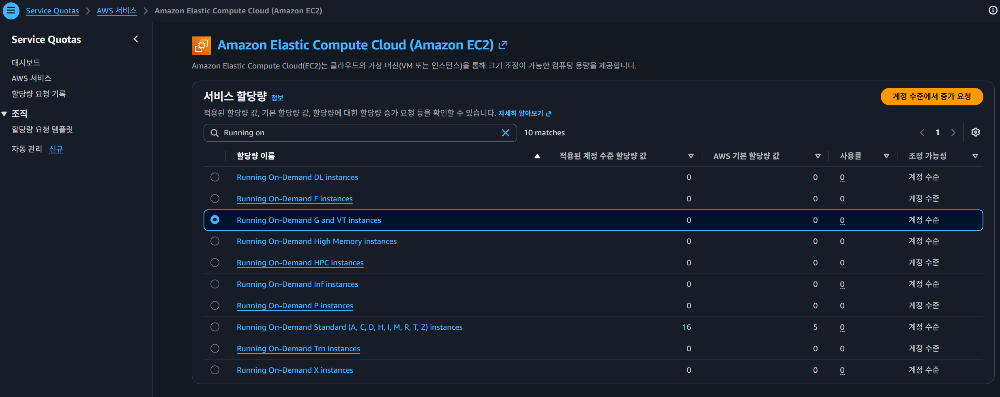

# 4. 학습 — 클라우드

> GPU 가 없거나 느릴 때. Google Colab 과 AWS EC2 에서 학습 돌리기.

[3번](3-train.md) 의 스모크 테스트로 계산한 시간이 감당이 안 되거나, NVIDIA 그래픽카드가 아예 없을 때 쓴다.

**학습 명령 자체는 3번과 같다.** 어디서 돌리느냐만 다르다. 3번을 먼저 읽고 올 것.

---

## 어느 쪽을 쓸까

| | Google Colab | AWS EC2 |
|---|---|---|
| 난이도 | **쉽다.** 브라우저만 있으면 된다 | **초기 세팅이 까다롭다.** 계정·한도·키·방화벽 |
| 준비 시간 | 5분 | 처음 한 번 1~2시간 (한도 승인 대기 포함) |
| 비용 | 무료 | 시간당 약 $1 |
| GPU | T4 (느림) | L4 (빠름) |
| 속도 | 약 1.5 step/s | 약 10.5 step/s |
| 연속 사용 | **무료는 몇 시간이면 끊긴다** | 원하는 만큼 |
| 추천 | **3만 스텝 이하** | 그 이상 |

### 3만 스텝을 기준으로 나뉜다

Colab 무료는 **대여 시간이 짧다.** 몇 시간 쓰면 세션이 끊기고 당분간 GPU 를 다시 못 받는다. T4 가 느린 것과 겹쳐서 긴 학습은 현실적으로 어렵다.

```
Colab T4    1.5 step/s   →   3만 스텝에 약 5시간 30분   ← 여기까지가 한계
AWS L4     10.5 step/s   →   10만 스텝에 약 2시간 40분
```

**먼저 Colab 으로 3만 스텝까지 해 보고**, 더 필요하면 AWS 로 넘어가는 순서가 무난하다. 체크포인트를 Hugging Face 에 올려 두면 이어서 학습할 수 있다.

---

## Google Colab

이 폴더의 **[`colab_train_act.ipynb`](colab_train_act.ipynb)** 를 쓴다. 셀을 위에서부터 실행하면 된다.

| 셀 | 하는 일 |
|---|---|
| 1 | 환경 확인 (GPU 가 잡혔는지) |
| 2 | Google Drive 연결 — 체크포인트를 여기에 저장 |
| 3 | lerobot 설치 |
| 4 | Hugging Face 인증 |
| 5 | **학습** |
| 6 | 세션이 끊겼을 때 이어서 학습 |
| 7 | 학습된 모델 내려받기 |

**5번 셀 맨 위의 값을 자기 것으로 바꾼다.**

```python
DATASET   = "<내-HF-아이디>/<데이터셋-이름>"
STEPS     = 30_000     # 세션 안에 끝날 만큼. 이어서 돌리면 되니 욕심내지 말 것
SAVE_FREQ = 5_000
```

### 1. 노트북을 Colab 에 올리기

`colab_train_act.ipynb` 는 **내 컴퓨터에 있는 파일**이다. Colab 은 웹사이트라서 여기에 올려야 열린다.

1. [colab.research.google.com](https://colab.research.google.com) 접속 (구글 계정으로 로그인)
2. 창이 뜨면 위쪽 탭에서 **업로드** 선택
   - 창이 안 뜨면 **파일 → 노트북 업로드**
3. **파일 선택** → 리포의 `projects/01-basic-workflow/colab_train_act.ipynb` 를 고른다
4. 노트북이 열린다

> 올린 노트북은 **내 Google Drive 의 `Colab Notebooks` 폴더**에 복사되어 저장된다.
> 다음부터는 업로드하지 않아도 Colab 첫 화면의 **최근 사용** 목록에서 바로 열린다.

> **고친 내용은 리포에 반영되지 않는다.** Colab 에서 노트북을 수정하면 Drive 의 사본만 바뀐다.
> 다른 사람도 쓸 만한 수정이라면 **파일 → 다운로드 → .ipynb** 로 받아서 리포에 넣고 PR 을 올릴 것.

### 2. GPU 켜기

**런타임 → 런타임 유형 변경 → T4 GPU → 저장**

안 켜면 CPU 로 돌아서 20배 느리다. 1번 셀을 실행하면 GPU 가 잡혔는지 확인할 수 있다.

### 3. Hugging Face 토큰 등록

데이터셋을 받고 모델을 올리는 데 필요하다.

1. 왼쪽 세로 막대의 **열쇠 아이콘**(보안 비밀) 클릭
2. ⭐ **새 보안 비밀 추가**
3. 이름은 `HF_TOKEN`, 값은 Hugging Face 의 **write 권한** 토큰
4. **노트북 액세스** 를 켠다 ← 이걸 켜야 노트북이 읽을 수 있다

> 토큰은 [huggingface.co/settings/tokens](https://huggingface.co/settings/tokens) 에서 만든다. 권한은 **write** 여야 한다.
> 이 방식으로 넣으면 **토큰이 노트북 내용에 안 남는다.** 셀에 직접 붙여 넣지 말 것 — 그러면 노트북을 공유할 때 같이 새어 나간다.

### 알아둘 것

- **체크포인트를 Google Drive 에 저장한다.** 세션이 끊겨도 다시 들어가서 이어서 학습할 수 있다
- Drive 무료 용량은 15GB, 체크포인트 하나가 약 **600MB** 다. 몇 개만 남기고 지워 가며 쓴다
- **브라우저 탭과 PC 를 켜 둬야 한다.** 무료 티어는 가만히 두면 끊는다

### T4 는 `bf16` 을 못 쓴다

3번에서 쓴 `--accelerator.mixed_precision=bf16` 을 T4 에서 그대로 쓰면 **오히려 느려진다.** T4 에는 bf16 전용 회로가 없어서 흉내만 내기 때문이다.

`fp16` 으로 바꿔야 한다. **노트북은 이걸 자동으로 판별한다.**

```python
MIXED_PRECISION = "bf16" if torch.cuda.is_bf16_supported(including_emulation=False) else "fp16"
```

직접 명령을 칠 때는 이렇게 준다.

```
--accelerator.mixed_precision=fp16
```

> **함정.** 파이토치의 `torch.cuda.is_bf16_supported()` 는 기본 설정에서 **흉내 내기까지 쳐서 T4 에도 `True`** 를 돌려준다. 이걸 믿고 자동 판별하면 느린 쪽으로 간다.
> `including_emulation=False` 를 줘야 제대로 판별된다.

---

## AWS EC2

> # 🚨 끝나면 인스턴스를 반드시 종료한다
>
> **켜 둔 시간만큼 계속 돈이 나간다.** 시간당 약 $1 이므로 하루를 잊으면 $24 다.
>
> 그리고 **`중지(stop)` 가 아니라 `종료(terminate)`** 여야 한다.
> 중지만 하면 디스크 요금이 계속 나간다.
>
> 자세한 방법은 [맨 아래](#끝나면-반드시-terminate) 에 있다. **시작하기 전에 먼저 읽을 것.**

### 이 절은 메인테이너용이다

AWS 는 **계정·한도·결제가 모두 개인 단위**다. 부원이 각자 계정을 만들고 한도를 신청하고 카드를 등록하는 것은 현실적이지 않다.

> ### 3만 스텝 넘게 학습해야 한다면 메인테이너에게 요청할 것
>
> 데이터셋을 Hugging Face 에 올려 두고, 몇 스텝까지 돌릴지 알려주면 된다.
> 결과는 Hub 에 올라오고, [5번](5-inference.md) 에서 받아 쓰면 된다.

아래는 메인테이너가 직접 돌릴 때의 절차다. 부원은 읽지 않아도 된다.

### 초기 세팅이 까다롭다

계정 한도 신청, 요금제 전환, 키 발급, 방화벽 설정을 **처음 한 번은 모두 거쳐야** 한다. 한도 승인은 보통 1시간 안쪽이지만 하루가 걸릴 수도 있다. **시간 여유를 두고 시작할 것.**

아래 명령은 **AWS CLI** 를 쓴다. 설치와 `aws configure` 가 먼저 필요하다. 웹 콘솔에서 클릭으로 해도 되고, 그쪽이 처음에는 더 쉽다.

사용한 것은 `g6.xlarge` (L4 24GB), 서울 리전 시간당 약 $0.99 다.

### 처음 한 번 — 계정 준비

#### 1) Paid Plan 전환 — 먼저 할 것

**이걸 먼저 한다.** Free Plan 상태로는 다음 단계의 한도 신청도 막힐 수 있다.

신규 계정은 Free Plan 이라 GPU 인스턴스를 못 띄운다.

```
An error occurred (InvalidParameterCombination) ... not eligible for Free Tier
```

**콘솔 우측 상단 계정 이름 → 과금 정보 및 비용 관리(Billing and Cost Management)** 로 들어가서, 왼쪽 메뉴에서 계정 플랜 관련 항목을 찾는다.

> **메뉴 이름이 문서와 다르면** 콘솔 상단 검색창에 `Billing` 을 치고, 왼쪽 메뉴에서 `계정 플랜`·`Account plan`·`Free tier` 비슷한 항목을 찾는다. **AWS 콘솔은 UI 가 자주 바뀐다.**
>
> Free Plan 계정이면 업그레이드 안내 배너가 떠 있는 경우가 많다.

크레딧이 있다면 그대로 유지된다.

> **이 단계는 캡처가 없다.**
> AWS 는 **Free Plan 상태일 때만** 업그레이드 화면을 보여준다. 한 번 전환하면 그 메뉴가 사라져서 다시 찍을 수 없다.
> 혹시 새 계정을 만드는 사람이 있다면 그때 캡처해서 `images/aws-paid-plan.png` 로 넣어주면 좋겠다.

#### 2) GPU 한도 신청

신규 계정은 GPU 인스턴스 한도가 **0** 이라 그냥은 못 띄운다.

**콘솔에서 — 권장**

```
AWS 콘솔 → Service Quotas
  → AWS 서비스
  → "Amazon Elastic Compute Cloud (Amazon EC2)" 검색 후 클릭
  → "Running On-Demand G and VT instances" 검색 후 클릭
  → 우측 상단 [계정 수준에서 증가 요청]
  → 할당량 값 증가에 8 입력
  → [요청]
```

> **Service Quotas 안에서 검색을 두 번** 한다. 먼저 서비스(EC2)를 찾고, 그 안에서 할당량 이름을 찾는 구조다.
> 비슷한 이름의 할당량이 많으니 **`G and VT`** 가 맞는지 확인할 것. `g6` 인스턴스가 여기 속한다.

**CLI 로 — 여러 번 할 때**

```powershell
# 현재 한도 확인
aws service-quotas get-service-quota `
    --service-code ec2 --quota-code L-DB2E81BA --region ap-northeast-2

# 8 로 올려 달라고 신청
aws service-quotas request-service-quota-increase `
    --service-code ec2 --quota-code L-DB2E81BA --desired-value 8 --region ap-northeast-2

# 승인됐는지 확인
aws service-quotas list-requested-service-quota-change-history `
    --service-code ec2 --region ap-northeast-2 `
    --query 'RequestedQuotas[].{Q:QuotaName,S:Status,V:DesiredValue}' --output table
```

> `L-DB2E81BA` 는 **G · VT 계열 인스턴스** 한도다. 할당량 목록에 비슷한 이름이 많은데, `g6` 을 쓰려면 이것이 맞다.



#### 3) 키페어 만들기

SSH 접속에 쓰는 열쇠 파일이다. **윈도우는 파일 권한을 좁혀야 ssh 가 받아준다.**

```powershell
aws ec2 create-key-pair --region ap-northeast-2 --key-name lerobot `
    --query KeyMaterial --output text | Out-File -Encoding ascii $HOME\.ssh\lerobot.pem

icacls $HOME\.ssh\lerobot.pem /inheritance:r
icacls $HOME\.ssh\lerobot.pem /grant:r "$($env:USERNAME):(R)"
```

권한을 안 좁히면 접속할 때 이런 게 나온다.

```
Permissions for 'lerobot.pem' are too open.
```

### 인스턴스 띄우기 — 여기서 과금이 시작된다

```powershell
aws ec2 run-instances --region ap-northeast-2 `
    --image-id ami-05bfd36e7686b161f `
    --instance-type g6.xlarge `
    --key-name lerobot `
    --block-device-mappings 'DeviceName=/dev/sda1,Ebs={VolumeSize=200,VolumeType=gp3}' `
    --tag-specifications 'ResourceType=instance,Tags=[{Key=Name,Value=lerobot-train}]' `
    --query 'Instances[0].InstanceId' --output text
```

AMI 는 **Deep Learning OSS Nvidia Driver AMI GPU PyTorch (Ubuntu 22.04)** 다. 드라이버가 미리 깔려 있다.

> AMI ID 는 리전과 시점에 따라 바뀐다. 위 ID 가 안 먹으면 콘솔에서 이름으로 검색해 최신 것을 쓸 것.

출력으로 나오는 `i-` 로 시작하는 값이 **인스턴스 ID** 다. 다음 단계에서 쓴다.

### SSH 로 접속

기본 방화벽은 외부 SSH 를 막는다. 안 열면 `Connection timed out` 이 난다. **내 IP 에서만** 22번 포트를 연다.

```powershell
$ID = "i-XXXXXXXXXXXX"      # 위에서 받은 인스턴스 ID

$SG = aws ec2 describe-instances --region ap-northeast-2 --instance-ids $ID `
    --query 'Reservations[0].Instances[0].SecurityGroups[0].GroupId' --output text
$MYIP = (curl.exe -s checkip.amazonaws.com).Trim()
aws ec2 authorize-security-group-ingress --region ap-northeast-2 `
    --group-id $SG --protocol tcp --port 22 --cidr "$MYIP/32"

$IP = aws ec2 describe-instances --region ap-northeast-2 --instance-ids $ID `
    --query 'Reservations[0].Instances[0].PublicIpAddress' --output text
ssh -i $HOME\.ssh\lerobot.pem ubuntu@$IP
```

> **`$ID` 와 `$IP` 는 다른 것이다.** `ubuntu@` 뒤에는 `i-...` 가 아니라 **IP 주소**가 온다.

> 공유기 IP 가 바뀌면 다시 막힌다. 새 IP 로 `authorize-security-group-ingress` 를 한 번 더 치면 된다.

> #### 📸 캡처 넣을 자리 — 접속 성공 화면
>
> `images/aws-ssh.png` 로 저장한다.
>
> - SSH 접속 직후 우분투 환영 메시지가 뜬 터미널
> - `ubuntu@ip-...` 프롬프트가 보이게
>
> 저장한 뒤 아래 줄의 `<!--` 와 `-->` 를 지워서 살린다.

<!--  -->

### 인스턴스 안에서 — 여기부터는 리눅스

```bash
tmux new -s train     # 먼저! SSH 가 끊겨도 학습이 계속 돈다
```

**`tmux` 를 먼저 켜는 것이 중요하다.** 안 켜면 노트북을 닫거나 인터넷이 끊기는 순간 학습도 같이 죽는다.

```bash
sudo apt-get update && sudo apt-get install -y ffmpeg

curl -LsSf https://astral.sh/uv/install.sh | sh && source $HOME/.local/bin/env
uv python install 3.12
uv venv --python cpython-3.12 ~/venv --clear
source ~/venv/bin/activate
uv pip install "lerobot[training] @ git+https://github.com/huggingface/lerobot.git"

hf auth login         # write 토큰
```

> `ffmpeg` 를 안 깔면 영상을 못 읽고 `libavutil` 에러가 난다.
> `uv venv --python cpython-3.12` 로 파이썬을 새로 받는 이유는, AMI 에 깔린 파이썬에 필요한 파일이 빠져 있어서다.

학습을 돌린다. 이미 Colab 등에서 학습한 것이 Hub 에 있다면 이어서 할 수 있다.

```bash
lerobot-train \
    --config_path=<내-HF-아이디>/<모델-이름> \
    --resume=true \
    --steps=100000 \
    --save_freq=10000 \
    --accelerator.mixed_precision=bf16 \
    --policy.repo_id=<내-HF-아이디>/<모델-이름> \
    --save_checkpoint_to_hub=true \
    --output_dir=/home/ubuntu/act_run
```

- `--config_path` 에 **Hub 주소**를 주면 거기 올라간 최신 체크포인트를 받아서 이어간다
- **처음부터 학습**할 때는 3번의 본 학습 명령에서 `--policy.push_to_hub=false` 를 빼고, `--policy.repo_id` 와 `--save_checkpoint_to_hub=true` 를 붙인다
- `--output_dir` 는 **절대경로**로 쓴다. `~/경로` 는 확장되지 않는다

tmux 사용법:

| 조작 | 하는 일 |
|---|---|
| `Ctrl` + `B` → `D` | 빠져나오기 (학습은 계속 돈다) |
| `tmux attach -t train` | 다시 들어가기 |
| `tmux ls` | 세션 목록 |

빠져나온 뒤 SSH 를 끊어도 된다. 나중에 다시 접속해서 `tmux attach` 하면 진행 상황이 보인다.

### 학습이 끝나면 자동으로 끄기

깜빡하고 켜 두면 요금이 계속 나간다. **새 tmux 세션**에서 걸어 둔다.

```bash
while pgrep -f lerobot-train > /dev/null; do sleep 60; done; sudo shutdown -h now
```

### 끝나면 반드시 terminate

> **`stop`(중지)은 디스크 요금이 계속 나간다.** 과금을 완전히 멈추려면 `terminate`(종료) 여야 한다.

```powershell
aws ec2 terminate-instances --region ap-northeast-2 --instance-ids $ID
```

확인한다. **인스턴스가 `terminated` 이고 볼륨 목록이 비어 있어야** 한다.

```powershell
aws ec2 describe-instances --region ap-northeast-2 `
    --query 'Reservations[].Instances[].{Id:InstanceId,State:State.Name}' --output table

aws ec2 describe-volumes --region ap-northeast-2 --query 'Volumes[].VolumeId' --output text
```

> 크레딧을 다 쓰면 등록한 카드로 청구된다.
> **Billing → Budgets 에 알림을 걸어 둘 것.** 금액을 정해 두면 넘길 때 메일이 온다.

---

## 다음

- [5-inference.md](5-inference.md) — 학습한 모델을 로봇에서 실행
